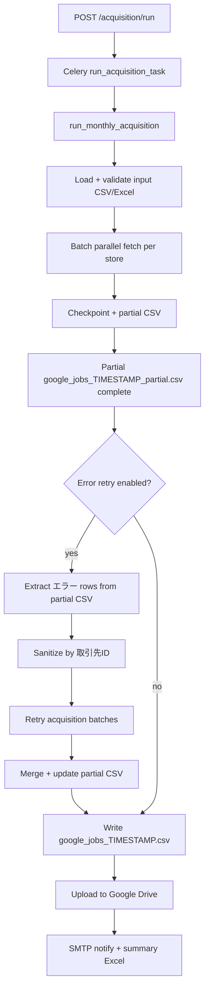

# Oxylab — Project Documentation

This document describes the full `src/` codebase: structure, modules, key methods, data flow, and how the acquisition pipeline (including the post-export error retry flow) works end to end.

---

## Table of Contents

1. [Overview](#overview)
2. [Project Structure](#project-structure)
3. [Architecture Layers](#architecture-layers)
4. [End-to-End Data Flow](#end-to-end-data-flow)
5. [Acquisition Pipeline (Main)](#acquisition-pipeline-main)
6. [Error Retry Pipeline (Post-Export)](#error-retry-pipeline-post-export)
7. [Module Reference](#module-reference)
8. [Configuration](#configuration)
9. [Output Artifacts](#output-artifacts)
10. [Telemetry](#telemetry)

---

## Overview

Oxylab is a **job acquisition pipeline** that:

1. Reads store/branch records from CSV or Excel input.
2. Queries Google Jobs (via SerpAPI, Oxylabs, or configured fallback providers) in parallel batches.
3. Aggregates listings into one output row per store.
4. Exports timestamped CSV/Excel reports.
5. **Retries failed (`エラー`) records** after the main run, then merges results.
6. Uploads the final merged CSV to Google Drive and optionally sends an SMTP notification.

The stack is **FastAPI** (HTTP API), **Celery** (background workers), **Redis** (broker), **pandas** (CSV/Excel), and optional **OpenTelemetry** tracing.

---

## Project Structure

```
oxylab/
├── src/
│   ├── main.py                          # FastAPI application entry
│   ├── celery_app.py                    # Celery worker + acquisition task
│   ├── dependencies.py                  # JobService dependency injection
│   │
│   ├── config/
│   │   └── settings.py                  # Environment-driven configuration
│   │
│   ├── models/
│   │   ├── acquisition.py               # API request/response models
│   │   ├── job.py                       # Job listing response models
│   │   └── error_retry.py               # Error retry pipeline types
│   │
│   ├── routers/
│   │   ├── health.py                    # GET / health check
│   │   ├── jobs.py                      # GET /jobs ad-hoc fetch
│   │   ├── acquisition.py               # POST /acquisition/run
│   │   └── job_router.py                # Re-export helper
│   │
│   ├── application/
│   │   ├── ports/
│   │   │   └── job_provider.py          # JobProvider protocol + FetchJobParams
│   │   └── services/
│   │       └── job_service.py           # Thin wrapper over JobProvider
│   │
│   ├── infrastructure/
│   │   ├── factories/
│   │   │   └── job_provider_factory.py  # Provider wiring (SerpAPI/Oxylabs/fallback)
│   │   ├── providers/
│   │   │   ├── serpapi_provider.py
│   │   │   ├── oxylabs_job_provider.py
│   │   │   ├── fallback_job_provider.py
│   │   │   └── rate_limited_job_provider.py
│   │   └── parallel_api_pool/           # Reusable API key pool (optional)
│   │
│   ├── services/                        # Domain / acquisition business logic
│   │   ├── acquisition_service.py       # Main orchestrator
│   │   ├── acquisition_validation.py    # Input load + validate
│   │   ├── acquisition_queries.py       # Search query variant generation
│   │   ├── acquisition_aggregation.py   # Jobs → one output row
│   │   ├── acquisition_reporting.py     # Export columns + Excel reports
│   │   ├── acquisition_persistence.py   # Checkpoints + dead queue
│   │   ├── acquisition_partial_csv.py   # Incremental partial CSV writer
│   │   ├── csv_error_extraction.py      # Read CSV, filter エラー rows
│   │   ├── error_record_sanitization.py # Trim, dedupe, filter empty IDs
│   │   ├── retry_acquisition.py         # Re-run fetch for error records
│   │   ├── result_merging.py            # Merge retry results into final CSV
│   │   ├── error_retry_orchestrator.py  # Coordinates post-export retry flow
│   │   ├── google_drive_upload.py       # Drive API v3 upload
│   │   ├── smtp_notification.py         # Post-upload email
│   │   └── job_listing_normalization.py
│   │
│   └── telemetry/
│       ├── setup.py
│       ├── acquisition_tracing.py
│       ├── celery_trace.py
│       └── context.py
│
├── data/
│   ├── input/                           # Default input CSV location
│   ├── output/                          # google_jobs_*.csv, summary_*.xlsx
│   └── logs/                            # Checkpoints, validation/errors logs
│
├── requirements.txt
├── Dockerfile
├── docker-compose.yml
└── PROJECT_DOCUMENTATION.md             # This file
```

---

## Architecture Layers

| Layer | Location | Responsibility |
|-------|----------|----------------|
| **HTTP / Tasks** | `routers/`, `celery_app.py` | Thin controllers; enqueue work, no business rules |
| **Orchestration** | `acquisition_service.py`, `error_retry_orchestrator.py` | Sequence pipeline steps; delegate to services |
| **Domain Services** | `services/*` | Validation, fetching, export, retry, merge, upload |
| **Application** | `application/` | Ports (`JobProvider`) and `JobService` facade |
| **Infrastructure** | `infrastructure/` | HTTP providers, rate limiting, API pools |
| **Models** | `models/` | Typed request/response and pipeline DTOs |

---

## End-to-End Data Flow



---

## Acquisition Pipeline (Main)

**Entry:** `run_monthly_acquisition()` in `src/services/acquisition_service.py`

### Steps

| Step | Module / Method | Description |
|------|-----------------|-------------|
| 1 | `acquisition_validation.load_store_file` | Read CSV/Excel (UTF-8 → Shift-JIS fallback) |
| 2 | `acquisition_validation.validate_records` | Require `store_name` + `city_ward_name`; dedupe; skip blanks |
| 3 | `acquisition_service._build_run_key` | Deterministic run ID from input path + params |
| 4 | `acquisition_persistence.load_checkpoint` | Resume prior progress when enabled |
| 5 | `acquisition_service._run_slice` | `ThreadPoolExecutor` batch parallel fetch |
| 6 | `acquisition_service._process_record` | Query variants → `JobService.get_jobs` → aggregate |
| 7 | `acquisition_partial_csv.IncrementalPartialCsvWriter` | Append rows after each record |
| 8 | Batch error retry (optional) | `BATCH_ERROR_RETRY_PASSES` re-runs errors within a batch |
| 9 | `acquisition_reporting.prepare_result_export_df` | JP columns + status mapping |
| 10 | **Error retry pipeline** | Read `google_jobs_{stamp}_partial.csv`; retry エラー rows; merge back into partial |
| 11 | Write `google_jobs_{stamp}.csv` | UTF-8 BOM CSV (from merged partial when retry ran) |
| 12 | `google_drive_upload.upload_local_file_to_drive` | Upload final CSV |
| 13 | `smtp_notification.send_drive_csv_link_email` | Optional notification |
| 14 | Summary / execution Excel reports | `summary_{stamp}.xlsx`, `execution_report_*.xlsx` |

### Key internal types (`acquisition_service.py`)

| Type | Fields | Purpose |
|------|--------|---------|
| `ValidationResult` | `valid_records`, `skipped_records` | Post-validation store list |
| `RecordProcessingResult` | `rows`, `processing_log`, `error`, `requests_made`, `status` | Per-store fetch outcome |
| `CheckpointState` | indices, rows, logs, errors, `requests_made` | Resumable run state |

### Per-record processing (`_process_record`)

1. Build query variants (`acquisition_queries.build_query_variants`).
2. Call `get_job_service().get_jobs(FetchJobParams(...))` with `retries=MAX_RETRIES`.
3. On jobs found → `aggregate_jobs_to_output_row` → `status=success`.
4. On empty → `status=no_result`.
5. On exception → `status=error` + dead-queue entry.

### Concurrency & rate limiting

- **Batch size:** `ACQUISITION_BATCH_SIZE` (default 50).
- **Workers:** `min(MAX_WORKERS, batch_size)`; capped by `OXYLABS_MAX_WORKERS` when Oxylabs is active.
- **Between batches:** `BATCH_DELAY_SECONDS`.
- **Provider retries:** `MAX_RETRIES`, `MAX_QUERY_ATTEMPTS`.
- **Rate limit wrapper:** `RateLimitedJobProvider` when `JOB_PROVIDER_MIN_INTERVAL_SECONDS > 0`.

---

## Error Retry Pipeline (Post-Export)

Runs **after** the main acquisition completes (partial CSV is populated) and **before** the final `google_jobs_{timestamp}.csv` is written and uploaded to Google Drive.

### Orchestrator

**`ErrorRetryOrchestrator.run()`** in `src/services/error_retry_orchestrator.py`

Sequences four dedicated services and returns `ErrorRetryPipelineResult`.

### Service 1 — CSV Error Extraction

**File:** `src/services/csv_error_extraction.py`  
**Class:** `CsvErrorExtractionService`

| Method | Purpose |
|--------|---------|
| `load_dataframe(csv_path)` | Load partial or final CSV as DataFrame |
| `extract_from_path(csv_path)` | Read partial CSV; filter rows where `status == エラー`; keep columns `企業名`, `事業所名`, `市区郡`, `取引先ID` |
| `extract_from_dataframe(df, source_path)` | Same extraction from an in-memory DataFrame (avoids double read) |

**Output type:** `CsvErrorExtractionResult` (`models/error_retry.py`)

### Service 2 — Data Sanitization

**File:** `src/services/error_record_sanitization.py`  
**Class:** `ErrorRecordSanitizationService`

| Method | Purpose |
|--------|---------|
| `sanitize(error_rows)` | Trim all values; skip empty `取引先ID`; dedupe by `取引先ID` (first wins) |

**Output type:** `SanitizationResult` with `SanitizedErrorRecord` list

### Service 3 — Retry Acquisition

**File:** `src/services/retry_acquisition.py`  
**Class:** `RetryAcquisitionService`

| Method | Purpose |
|--------|---------|
| `run(records, pages, limit_per_query, fetched_at, trace_ctx, run_key)` | Re-run `_process_record` for each sanitized record using the same batching, `ThreadPoolExecutor`, `BATCH_DELAY_SECONDS`, and telemetry as the main pipeline |

**Output type:** `RetryAcquisitionResult` with per-record `RetryRecordResult`

### Service 4 — Result Merging

**File:** `src/services/result_merging.py`  
**Class:** `ResultMergingService`

| Method | Purpose |
|--------|---------|
| `merge(original_df, retry_result, retried_customer_ids)` | Remove prior `エラー` rows for retried `取引先ID`; append retry rows; dedupe by `取引先ID` (last wins); map status to Japanese |

**Output type:** `MergeResult` + merged `DataFrame`

### Audit log fields

After a retry pass, the orchestrator logs:

| Metric | Meaning |
|--------|---------|
| `total_error_records_found` | Rows with `status=エラー` in the initial CSV |
| `total_records_retried` | Sanitized unique `取引先ID` count sent to retry |
| `successful_retries` | Retry results with `status=成功` |
| `failed_retries` | Retry results still `エラー` |
| `final_output_count` | Row count in merged CSV uploaded to Drive |

### Final Drive upload contents

The uploaded CSV contains:

- All original **成功** and **結果なし** rows (unchanged)
- **Successful retry** rows (replacing prior errors for those IDs)
- **Remaining failed** retry rows (if any)
- Error rows **not retried** (e.g. empty `取引先ID` skipped during sanitization)

---

## Module Reference

### Entry points

| File | Symbol | Usage |
|------|--------|-------|
| `main.py` | `app` | `uvicorn src.main:app` — mounts health, jobs, acquisition routers |
| `celery_app.py` | `run_acquisition_task` | Celery task; autoretry max 3; calls `run_monthly_acquisition` |
| `routers/acquisition.py` | `POST /acquisition/run` | Enqueues Celery acquisition job |
| `routers/jobs.py` | `GET /jobs` | Single ad-hoc job search (no CSV batch) |
| `routers/health.py` | `GET /` | Health check |

### `acquisition_service.py` — main methods

| Function | Role |
|----------|------|
| `run_monthly_acquisition(...)` | Full pipeline orchestrator |
| `_process_record(record, pages, limit_per_query, fetched_at)` | Fetch jobs for one store |
| `_run_slice(batch_ctx, indices, is_retry, retry_pass)` | Parallel batch execution |
| `_ingest_process_result(...)` | Update checkpoint, dead queue, partial CSV |
| `_purge_state_for_indices(...)` | Clear stale rows before intra-batch retry |
| `_worker_pool_size(pool_for_n)` | Compute thread pool size |

### `acquisition_validation.py`

| Function | Role |
|----------|------|
| `load_store_file(path)` | Load CSV/Excel with column alias mapping |
| `apply_input_field_mapping(df)` | Map JP/legacy headers to canonical names |
| `validate_records(df)` | Validate, dedupe, build record list |
| `build_validation_log_records(df, validation)` | Per-input-row validation log |

### `acquisition_queries.py`

| Function | Role |
|----------|------|
| `build_query(city_ward_name, store_name, char_limit)` | Base search query |
| `build_query_variants(...)` | Suffix/alias/JP query variants |

### `acquisition_aggregation.py`

| Function | Role |
|----------|------|
| `aggregate_jobs_to_output_row(jobs, ...)` | Collapse job list to one store row |
| `listing_media_name(job, normalize_fn)` | Derive media label from URL |

### `acquisition_reporting.py`

| Function | Role |
|----------|------|
| `prepare_result_export_df(df)` | Column order, JP headers, ISO8601 timestamps |
| `output_row_with_input(record, row)` | Attach `企業名` / `事業所名` / `市区郡` / `取引先ID` |
| `status_to_ja(status)` | Map `success` → `成功`, `error` → `エラー`, etc. |
| `write_execution_report_excels(log_dir, payload)` | Per-run + append-only index Excel |

### `acquisition_persistence.py`

| Function | Role |
|----------|------|
| `checkpoint_path` / `dead_queue_path` | File paths under `data/logs/` |
| `load_checkpoint` / `save_checkpoint` | JSON checkpoint read/write |
| `append_dead_queue` / `load_dead_queue` / `rewrite_dead_queue` | Failed-index persistence |

### `acquisition_partial_csv.py`

| Class | Role |
|-------|------|
| `IncrementalPartialCsvWriter` | Thread-safe incremental `google_jobs_*_partial.csv` |

### `google_drive_upload.py`

| Function | Role |
|----------|------|
| `upload_local_file_to_drive(path, service_account_json, parent_folder_id)` | Drive API v3 resumable upload |

### `smtp_notification.py`

| Function | Role |
|----------|------|
| `send_drive_csv_link_email(csv_filename, drive_url, ...)` | Production SMTP notification after Drive upload |

Reads `SMTP_HOST`, `SMTP_PORT`, `SMTP_SECURITY`, `SMTP_USERNAME`, `SMTP_PASSWORD`, and `EMAIL_*` from `.env`. Supports Brevo/Sendinblue (`smtp-relay.sendinblue.com:587` with `SMTP_SECURITY=TLS`). Logs connection, authentication, and delivery failures without exposing credentials.

### Application layer

| File | Symbol | Role |
|------|--------|------|
| `application/ports/job_provider.py` | `JobProvider`, `FetchJobParams` | Provider interface |
| `application/services/job_service.py` | `JobService.get_jobs` | Delegates to provider |
| `infrastructure/factories/job_provider_factory.py` | `JobProviderFactory.create` | Build SerpAPI/Oxylabs/fallback chain |
| `dependencies.py` | `get_job_service()` | Cached `JobService` for API and acquisition |

### Infrastructure providers

| Provider | File | Notes |
|----------|------|-------|
| SerpAPI | `serpapi_provider.py` | `engine=google_jobs`; retries on 5xx/network |
| Oxylabs | `oxylabs_job_provider.py` | HTML scrape + optional enrichment |
| Fallback | `fallback_job_provider.py` | Try providers in order |
| Rate limited | `rate_limited_job_provider.py` | Global min interval between calls |

### Models

| File | Types |
|------|-------|
| `models/acquisition.py` | `AcquisitionRunRequest`, `AcquisitionEnqueueResponse` |
| `models/job.py` | `Job`, `JobListResponse` |
| `models/error_retry.py` | `ErrorCsvRow`, `CsvErrorExtractionResult`, `SanitizedErrorRecord`, `SanitizationResult`, `RetryRecordResult`, `RetryAcquisitionResult`, `MergeResult`, `ErrorRetryPipelineResult` |

---

## Configuration

Key environment variables (see `src/config/settings.py`):

| Variable | Default | Purpose |
|----------|---------|---------|
| `INPUT_PATH` | `data/input/stores.csv` | Default acquisition input |
| `OUTPUT_DIR` | `data/output` | CSV/Excel output directory |
| `LOG_DIR` | `data/logs` | Checkpoints, logs, execution reports |
| `ACQUISITION_BATCH_SIZE` | `50` | Records per parallel batch |
| `MAX_WORKERS` | `10` | Thread pool cap |
| `BATCH_DELAY_SECONDS` | `0` | Pause between batches |
| `BATCH_ERROR_RETRY_PASSES` | `0` | Intra-batch error retries |
| `ACQUISITION_ERROR_RETRY_ENABLED` | `true` | Post-export エラー retry before Drive |
| `MAX_RETRIES` | `3` | Provider HTTP retries |
| `MAX_QUERY_ATTEMPTS` | `5` | Query variant attempts per store |
| `JOB_PROVIDER` / `JOB_PROVIDERS` | `serpapi` | Active job source(s) |
| `GOOGLE_DRIVE_SERVICE_ACCOUNT_JSON` | — | Drive upload credentials path |
| `GOOGLE_DRIVE_FOLDER_ID` | — | Target Drive folder |
| `GOOGLE_DRIVE_USE_TEMP_URL` | `false` | Skip real upload; use placeholder URL |
| `SMTP_HOST` | — | SMTP relay hostname (e.g. `smtp-relay.sendinblue.com`) |
| `SMTP_PORT` | `587` | SMTP port (`587` for STARTTLS, `465` for SSL) |
| `SMTP_SECURITY` | `TLS` | `TLS` (STARTTLS), `SSL`, or `NONE` |
| `SMTP_USERNAME` | — | SMTP login (Brevo account email); `SMTP_USER` alias supported |
| `SMTP_PASSWORD` | — | SMTP API key / password (set only in `.env`, never commit) |
| `EMAIL_FROM` | falls back to `SMTP_USERNAME` | Sender address |
| `EMAIL_RECIPIENTS` | — | Comma-separated notification recipients |
| `EMAIL_CSV_LINK_URL` | — | Drive folder URL included in post-upload email |
| `CELERY_BROKER_URL` | auto | Redis broker for Celery |

---

## Output Artifacts

| File pattern | Location | Description |
|--------------|----------|-------------|
| `google_jobs_{YYYYMMDD_HHMMSS}.csv` | `data/output/` | **Final merged** acquisition CSV (uploaded to Drive) |
| `google_jobs_{stamp}_partial.csv` | `data/output/` | Incremental export during processing |
| `summary_{stamp}.xlsx` | `data/output/` | Execution summary, media counts, error list |
| `validation_{stamp}.csv` | `data/logs/` | Input validation log |
| `errors_{stamp}.csv` | `data/logs/` | Processing log (per-store outcomes) |
| `execution_report_{stamp}.xlsx` | `data/logs/` | Per-run metadata report |
| `execution_reports.xlsx` | `data/logs/` | Append-only index of all runs |
| `checkpoints/acquisition_{run_key}.json` | `data/logs/` | Resumable checkpoint |
| `dead_queue/dead_queue_{run_key}.jsonl` | `data/logs/` | Failed indices for cross-run retry |

### Export CSV columns (main result)

**Input columns (Japanese):** `企業名`, `事業所名`, `市区郡`, `取引先ID`

**Result columns:** `query_string`, `Acquisition_date_and_time`, `has_job_listing`, `job_count`, `Indeed_listed`, `Baitoru_listed`, `MynaviBaito_listed`, `other_media_count`, `job_title`, `job_url`, `job_type`, `status`

**Status values:** `成功`, `結果なし`, `エラー`

---

## Telemetry

When OpenTelemetry is enabled (`OTEL_EXPORTER_OTLP_ENDPOINT` or related env):

| Module | Spans |
|--------|-------|
| `telemetry/acquisition_tracing.py` | Pipeline, batch, record, scrape, CSV export, Drive upload, email |
| `telemetry/celery_trace.py` | Trace context propagation into Celery tasks |
| `telemetry/context.py` | Parent context for `ThreadPoolExecutor` workers |

Retry batches use `span_parallel_scrape(..., is_retry=True)` and dedicated batch IDs suffixed with `-retry`.

---

## Running the Project

### API server

```bash
uvicorn src.main:app --reload
```

### Celery worker

```bash
celery -A src.celery_app worker --loglevel=info
```

Acquisition completion emails are sent from the Celery worker via `smtp_notification.send_drive_csv_link_email` using the SMTP settings in `.env`.

### SMTP (production)

Configure Brevo/Sendinblue (or any SMTP provider) in `.env`:

```bash
SMTP_HOST=smtp-relay.sendinblue.com
SMTP_PORT=587
SMTP_SECURITY=TLS
SMTP_USERNAME=your-brevo-login@example.com
SMTP_PASSWORD=your-brevo-smtp-key
EMAIL_FROM=your-brevo-login@example.com
EMAIL_RECIPIENTS=recipient@example.com
```

Set `SMTP_PASSWORD` only in `.env` on the server — never commit it. After an acquisition run with a successful Drive upload, check worker logs for `Drive CSV link emailed to ...` or SMTP error details.

### Trigger acquisition

```bash
curl -X POST http://127.0.0.1:8000/acquisition/run \
  -H "Content-Type: application/json" \
  -d '{"input_path": "data/input/stores.csv", "pages": 1, "limit_per_query": 20}'
```

### Disable post-export error retry

```bash
ACQUISITION_ERROR_RETRY_ENABLED=false
```

---

## Design Notes

1. **Thin orchestrators:** `run_monthly_acquisition` and `ErrorRetryOrchestrator` coordinate services; business rules live in dedicated service classes.
2. **No change to core fetch logic:** Retry reuses `_process_record` unchanged, preserving query variants, provider retries, and aggregation.
3. **Partial CSV as source of truth for errors:** The retry pipeline reads `google_jobs_{stamp}_partial.csv` (incremental export) so it operates on the live batch output before the final export is written.
4. **Idempotent merge:** Retried `取引先ID` values replace prior `エラー` rows; deduplication prevents duplicate IDs in the final file.
5. **Checkpoint / dead queue:** Separate from post-export retry; handles mid-run failures and cross-run resume via `resume_from_checkpoint` and `retry_dead_queue` API flags.
